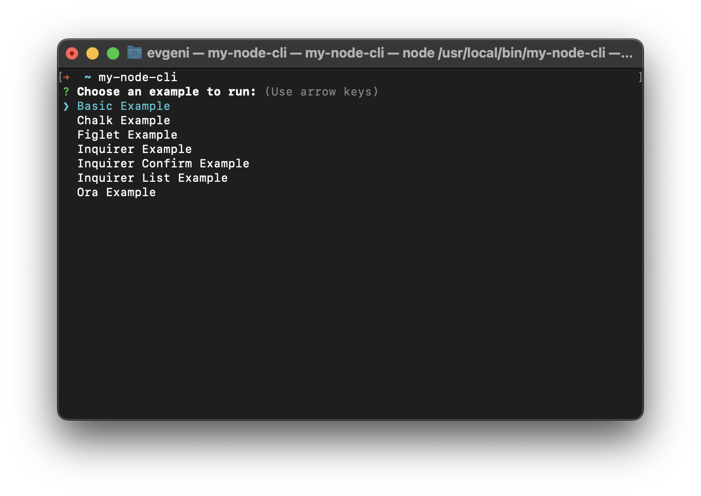

# My Node CLI

An example project to demonstrate the creation of a CLI using Node.js.

<a href="https://egmz.medium.com">Building a CLI with Node.js in 2024</a>



## Project Structure

Below is the folder and file structure:

```
.
├── README.md
├── bin
│   └── index.js
├── package-lock.json
├── package.json
└── src
    ├── commands
    │   ├── basic-example.js
    │   ├── chalk-example.js
    │   ├── figlet-example.js
    │   ├── inquirer-confirm-example.js
    │   ├── inquirer-example.js
    │   ├── inquirer-list-example.js
    │   └── ora-example.js
    └── utils
```

<br>

## Installation

Ensure you have Node.js installed on your computer

1. Clone the repository to your local machine using Git:

   ```bash
   git clone https://github.com/egmzy/my-node-cli.git
   ```

2. Navigate to the project directory:

   ```bash
   cd my-node-cli
   ```

3. Install the project dependencies:

   ```bash
   npm install
   ```

4. Link the project globally to make the `my-node-cli` command available on your system:
   ```bash
   npm link
   ```
   This step allows you to run the `my-node-cli` command from anywhere in your terminal.

<br>

## Usage

After installation, you can run the CLI by typing `my-node-cli` in your terminal. This command will display a list of examples that you can choose from, demonstrating various CLI functionalities:

- Basic Example
- Chalk Example
- Figlet Example
- Inquirer Confirm Example
- Inquirer Example
- Inquirer List Example
- Ora Example

Select an example to run it and see the functionality in action.

<br>

## Contributing

Contributions are welcome! Please feel free to fork the repository, make changes, and submit pull requests.
